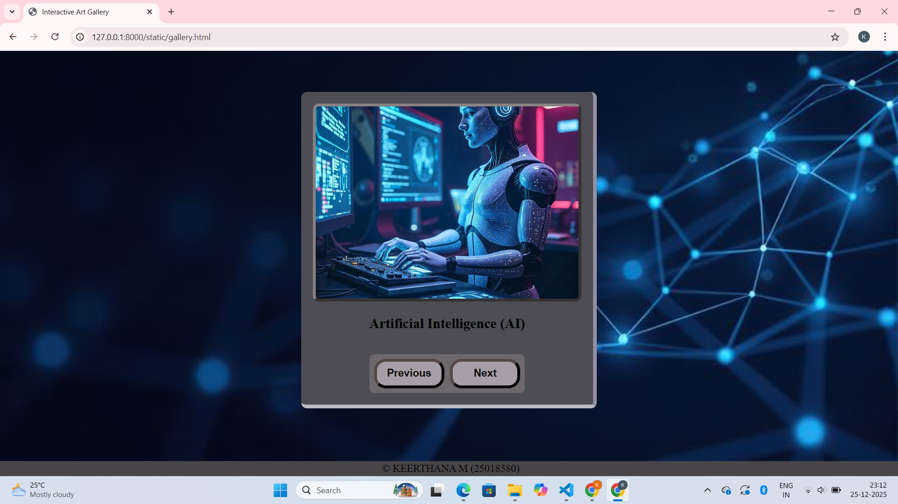
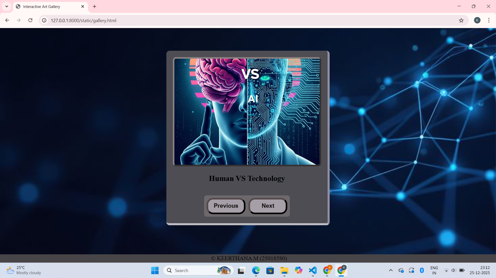
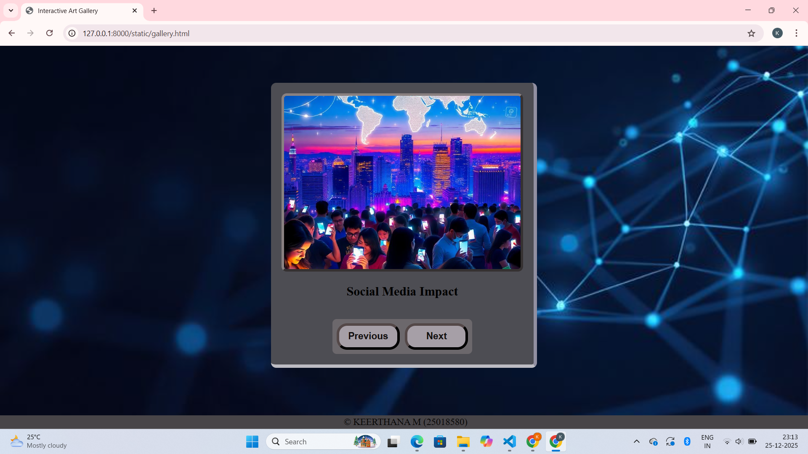
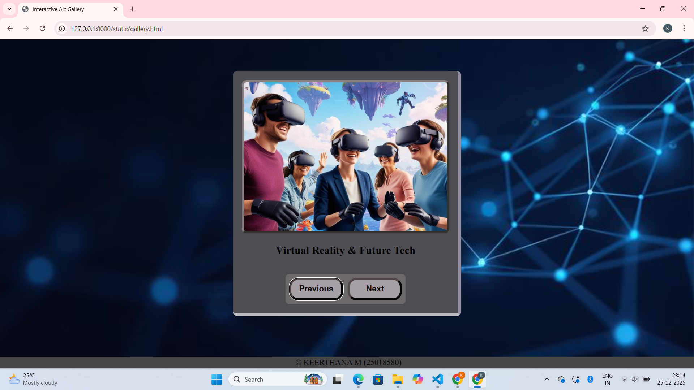
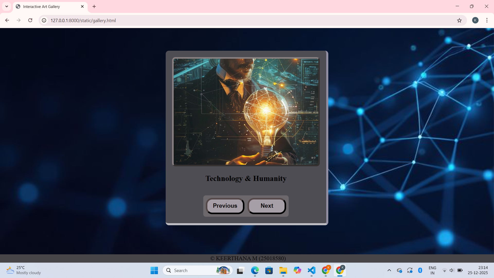

# Ex.07 Design of Interactive Image Gallery
## Date:25.12.25

## AIM:
To design a web application for an inteactive image gallery for a minimum five images with next and previous buttons.

## DESIGN STEPS:

### Step 1:
Clone the github repository and create Django admin interface.

### Step 2:
Change settings.py file to allow request from all hosts.

### Step 3:
Use CSS for positioning and styling.

### Step 4:
Write JavaScript program for implementing interactivity.

### Step 5:
Validate the HTML and CSS code.

### Step 6:
Publish the website in the given URL.

## PROGRAM:
```
gallery.html

<html>
    <head>
        <title>Interactive Art Gallery</title>
        <link href="gallery.css" rel="stylesheet">
        <script src="gallery.js"></script>
    </head>
    <body>
        <div class="container">

            <div class="image-box">
                
                <p class="about" id="about">
                    <b>Artificial Intelligence (AI)</b>
                </p>
            </div>

            <div class="buttons">
                <button onclick="prev()">Previous</input>
                <button onclick="next()">Next</input>
            </div>

        </div>
        <div class="footer">
            <p>&copy; KEERTHANA M (25018580)</p>
        </div>
    </body>

</html>

gallery.css

body
{
    background: url('bg.png')no-repeat bottom / cover;
}
.container
{
    display:flex;
    justify-content: center;
    align-items: center;    
    background-color: rgb(77, 77, 83);
    width: fit-content;
    padding:20px;
    margin: 70px auto; 
    flex-direction: column;
    border-radius: 10px;
    border-right:#918fa1 solid 7px;
    border-bottom:#bdbcc3 solid 7px;
}
.image-box img
{
    width:450px;
    height:330px;
    object-fit: cover;
    border-radius: 10px;
    border: outset rgb(137, 129, 129) 5px;
}
.image-box, .about
{
    text-align: center;
    font-size: 24px;
    font-weight: bold;
    color: rgb(24, 22, 24) 5px;
    
}
.buttons
{
    display: flex;
    gap: 10px;             
    margin-top: 15px;
    background-color: #6c686c; 
    padding: 8px;
    border-radius: 8px;
   
}
button
{
    width: 120px;
    padding: 10px;
    font-size: 18px;
    font-weight: bold;
    background-color: #a69fa7;
    color: rgb(18, 15, 15);
    border: none;
    border-radius: 20px 20px 20px 20px;
    cursor: pointer;
    border: outset rgb(84, 72, 72) 5px;
}

.footer p
{
    position:fixed;
    background-color: rgb(72, 69, 72);
    left:0;
    bottom:0;
    width:100%;
    color:rgb(8, 8, 8);
    text-align: center;
    font-size: 18px;
    padding: 3px;
    margin-bottom: 0px;
}

gallery.js

var img = [
    {image:"1.png", about:"Artificial Intelligence (AI)"},
    {image:"2.png", about:"Human VS Technology"},
    {image:"3.png", about:"Social Media Impact"},
    {image:"4.png", about:"Virtual Reality & Future Tech"},
    {image:"5.png", about:"Technology & Humanity"},
   
];
var index=0;
function next()
{
    index++;
    if(index >= img.length)
        index = 0;
    document.getElementById("image").src = img[index].image;
    document.getElementById("about").innerHTML = img[index].about;
}

function prev()
{
    index--;
    if(index < 0)
        index = img.length - 1;
    document.getElementById("image").src = img[index].image;
    document.getElementById("about").innerHTML= img[index].about;
}

```
## OUTPUT:






## RESULT:
The program for designing an interactive image gallery using HTML, CSS and JavaScript is executed successfully.
